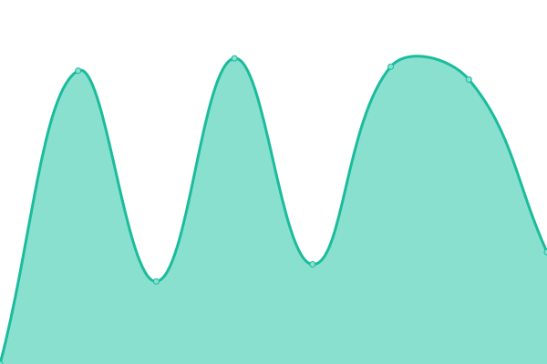
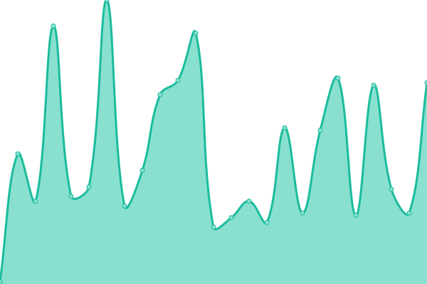
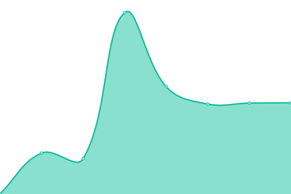

# [📈 Live Status](https://upptime.drawbeat.com): <!--live status--> **🟧 Partial outage**

This repository contains the open-source uptime monitor and status page for [drawbeat](drawbeat.com), powered by [Upptime](https://github.com/upptime/upptime).

With [Upptime](https://upptime.js.org), you can get your own unlimited and free uptime monitor and status page, powered entirely by a GitHub repository. We use [Issues](https://github.com/drawbeat/upptime/issues) as incident reports, [Actions](https://github.com/drawbeat/upptime/actions) as uptime monitors, and [Pages](https://upptime.drawbeat.com) for the status page.

<!--start: status pages-->
<!-- This summary is generated by Upptime (https://github.com/upptime/upptime) -->
<!-- Do not edit this manually, your changes will be overwritten -->
<!-- prettier-ignore -->
| URL | Status | History | Response Time | Uptime |
| --- | ------ | ------- | ------------- | ------ |
|  [drawbeat.com](http://drawbeat.com) | 🟩 Up | [drawbeat-com.yml](https://github.com/drawbeat/upptime/commits/HEAD/history/drawbeat-com.yml) | 

 3663ms
     
 | 

<a href="https://upptime.drawbeat.com/history/drawbeat-com">100.00%</a>
    

|  [admin.drawbeat.com](http://admin.drawbeat.com) | 🟩 Up | [admin-drawbeat-com.yml](https://github.com/drawbeat/upptime/commits/HEAD/history/admin-drawbeat-com.yml) | 

 118ms
     
 | 

<a href="https://upptime.drawbeat.com/history/admin-drawbeat-com">98.57%</a>
    

|  [api.drawbeat.com](https://api.drawbeat.com/v1/auth/me) | 🟥 Down | [api-drawbeat-com.yml](https://github.com/drawbeat/upptime/commits/HEAD/history/api-drawbeat-com.yml) | 

 495ms
     
 | 

<a href="https://upptime.drawbeat.com/history/api-drawbeat-com">98.58%</a>
    

<!--end: status pages-->

[**Visit our status website →**](https://upptime.drawbeat.com)

## 📄 License

- Powered by: [Upptime](https://github.com/upptime/upptime)
- Code: [MIT](./LICENSE) © [drawbeat](drawbeat.com)
- Data in the `./history` directory: [Open Database License](https://opendatacommons.org/licenses/odbl/1-0/)
